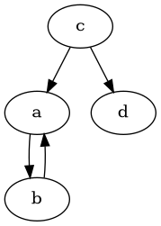
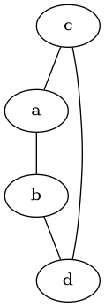

# Graph

Graph theory and its algorithms have endless application in computer science.

## Definitions

### Directed graph

It's couple $G = (V, E)$, where

* $V$ is a set of nodes, or vertex
* $E$ is a set of *ordered* couples $(u, v)$ of nodes, called *edges*

E.g.

$$
V = \{ a, b, c, d \} 
$$
$$
E = \{ (a, b), (b, a), (c,a), (c,d) \}
$$

### Undirected graph

It's couple $G = (V, E)$, where

* $V$ is a set of nodes, or vertex
* $E$ is a set of *unordered* couples $(u, v)$ of nodes, called *edges*

E.g.

$$
V = \{ a, b, c, d \} 
$$
$$
E = \{ (a, b), (c,a), (c,d), (b, d) \}
$$

A vertex $v$ is said to be adjacent to $u$ if $\exists (v,u) \in E$

### Dimension of a graph

Given a graph $G = (V,E)$, we define

* $n = |V|$: as the number of nodes
* $m = |E|$: as the number of edges

In a undirected graph we have:

$$

m \leq \frac{n!}{2!(n - 2)!} = \frac{n(n-1)}{2} = O(n^2)

$$

In a directed graph, we have:

$$

m \leq n^2 - n = O(n^2)

$$

We define a graph $G = (V,E)$ as complete if all the nodes are connected.

## Computational representation of a graph

### Collection of adjacency list

### Collection of adjacency matrix
